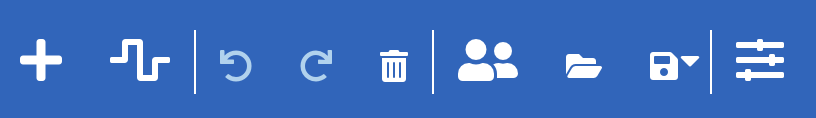

# What is it?

The Participatory System Mapper (PSysMap for short) is an app that runs in a web browser that makes it easy for a group of people working together to draw networks (or 'maps') of systems.  
## Maps
The network or map can be anything that has items (or 'nodes') connected by links (or 'edges').  Here are some examples:
* People (the nodes) connected by knowing each other
* Factors or variables causing (the links) changes in other factors
* Switches connected by wires
* Computers connected by network links
* Theories expressed as variables and relationships between them
* Company boards of directors (the nodes) and the directors that sit on more than one board (the links)
* Twitter hashtags (the nodes) included together on posts (the links)
* Scientists (the nodes) co-authoring papers (the links)
* and so on.
## Systems
The software is aimed at people who are interested in understanding whole systems.  A system is [a group of interacting or interrelated entities that form a unified whole](https://en.wikipedia.org/wiki/System).
## Participatory

# How do you install it?
No installation on users' computers is needed.  The software is a web app, which means that it can be accessed using a web browser by pasting this link into the address bar:

https://cress.soc.surrey.ac.uk/prism/prism.html

The software is free anad availble under an [MIT](https://choosealicense.com/licenses/mit/) license.

The code is available on [GitHub](https://github.com/micrology/prism).

# How do you use it?
Click [here](https://cress.soc.surrey.ac.uk/prism/prism.html) to load the app into your browser.
At the top of the screen are a row of icons:

This what they do:
* **New factor (or node)**.  Click on the cross and then click on the blank area below to create anode for the network.  A msall dialog box will open for you to type in a lable for the node.
* **New link** (or edge). Click on the line icon and then drag from one node to another to link them.
* **Undo**. Reverses the last action (e.g. if you have just created a new node, it will be removed).
* **Redo**. Redo the last action (e.g. if you have just undone the creation of a node, this will return the node to the network).
* **Bin**. First, slect a node or a link by clicking on it.  Note that the node or link is listed in the status bar at the bottom of the window. Then click on the bin icon.  the node or link is deleted.  Undo will restire it if you click on that next.
* **Share**. Shows a dialog box with a web link that you can copy and send to soneone else.  If they then acces that link, they will see your network and can edit and add to it.
* **Open file**. Read in a file containing a network from your computer drive.  See below for supported file formats.  The contents of the file replaces the network in the browser.
* **Save file**.  Save the network in a file on your computer. The file is saved in the app's own format, or if you click on the small triangle next to the icon, you can choose to save in GML (Graph Markup Lanhauage) or CSV (Comma Separated Values) formats.
* **Settings**. Opens panel that allows much more customisation and exploration of the network (see Advanced features below).

# Privacy and security

# Advanced features

