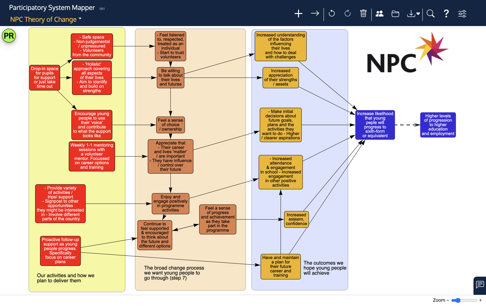

# Participatory System Mapper

## What is it?

The Participatory System Mapper (PSysMap for short) is an app that runs in a web browser that makes it easy for a group of people working together to draw networks (or 'maps') of systems.  

### Maps

The network or map can be anything that has items (or 'nodes') connected by links (or 'edges').  Here are some examples:

* People (the nodes) connected by knowing each other
* Factors or variables causing (the links) changes in other factors
* Switches connected by wires
* Computers connected by network links
* Theories expressed as variables and relationships between them
* Company boards of directors (the nodes) and the directors that sit on more than one board (the links)
* Twitter hashtags (the nodes) included together on posts (the links)
* Scientists (the nodes) co-authoring papers (the links)
* and so on.

### Systems

The software is aimed at people who are interested in understanding whole systems.  A system is [a group of interacting or interrelated entities that form a unified whole](https://en.wikipedia.org/wiki/System).

### Participatory system mapping

The app is designed to enable groups of people, each using their own computer (or tablet) to participate in the drawing of a map.  They may be sitting around a table, discussing the map as it is created face to face, or working remotely, using video conferencing or the chat feature that is built into the app.  Everyone can participate because every edit (creating nodes and links, arranging them and so on) is broadcast to all the other participants as the changes are made (just as Google Docs does for text, for example).  

When you start the app in your browser, a 'room' is created for you in which to draw your network.  Then you can add other users to this room to share the work.  Only those with access to the room can see what is being created.

## Examples
These are a few examples of what you can do with the app:

## How do you install it?

No installation on users' computers is needed.  The software is a web app, which means that it can be accessed using a web browser by pasting this link into the address bar:

<https://cress.soc.surrey.ac.uk/prism/prism.html>

The software is free and available under an [MIT](https://choosealicense.com/licenses/mit/) license.

The code is available on [GitHub](https://github.com/micrology/prism).

## How do you use it?

Click [here](https://cress.soc.surrey.ac.uk/prism/prism.html) to load the app into your browser.
At the top of the screen are a row of buttons:

This what they do:

* **New factor (or node)**.  Click on the cross and then click on the blank area below to create a node for the network.  A small dialog box will open for you to type in a label for the node.
* **New link** (or edge). Click on the line button and then drag from one node to another to link them. If you wish, you can have two links between a pair of nodes: one for each direction.

* **Undo**. Reverses the last action (e.g. if you have just created a new node, it will be removed).
* **Redo**. Redo the last action (e.g. if you have just undone the creation of a node, this will return the node to the network).
* **Bin**. First, select a node or a link by clicking on it.  Note that the node or link is listed in the status bar at the bottom of the window. Then click on the bin button - the node or link is deleted.  Undo will restore it if you click on that button next.
* **Share**. Shows a dialog box with a web link that you can copy and send to someone else.  If they then access that link, they will see your network and can edit and add to it.
* **Open file**. Read in a file containing a network from your computer drive.  See below for supported file formats.  The content of the file replaces the network in the browser.
* **Save file**.  Save the network in a file on your computer. The file is saved in the app's own format, or if you click on the small triangle next to the button, you can choose to save in GML (Graph Markup Language) or CSV (Comma Separated Values) formats.
* **Settings**. Opens a panel that allows much more customisation and exploration of the network (see [Advanced features](#advanced-features) below).

To select a node or a link, click on it. To select more than one, click on one node or link and then hold down the pointer over the other.  At the bottom of the window is the status bar, which will show which nodes and links have been selected.

Also at the bottom of the window on the right is a slider that will adjust the magnification: slide to the right to make the nodes and links larger and to the left to make them smaller (or click on the + and - signs).  To return the network to a size that will fit neatly in the window, double click anywhere on the network background.

Each node can be moved across the network pane by selecting it and dragging.  The whole network can be moved by dragging the background.

### Sharing

If you use the link above to start the app, a new room is created for you.  When you click on the share icon, a dialog box is shown that includes the name of the room in the link that is displayed:

Click the button to copy the web link to the clipboard, and then you can paste the link into an email, or a text message or just tell other participants the name of the room (which is a randomly generated set of 4 groups of three capital letters separated by hyphens).  When they access the link, they will see whatever is in your app window.

### Formatting nodes and links

Double clicking on a node or a link will bring up a small dialog that enables you to change the design of the node or link - its colour, shape or the label.

See [Advanced features](#advanced-features) for more on changing the look of nodes and links.

### The chat window

Clicking on the small blue square at the bottom right  opens up a chat window that you can use to type messages to other participants in your room.

Your name at the top is initially randomly generated, but if you click on the name, you can substitute your own name.  Then you can write messages in the box at the bottom and send then by clicking the paper plane button.  Use the X to close the chat window.

If someone has sent you a message but your chat window is closed, the  button will gently pulse to remind you to open the chat window.

### Privacy and security

The only way to join the room and see the network is by using the randomly generated room name, and the chances of finding that name by trial and error is very, very small.  The network is not stored on any server (there is a central server, but this is only used to broadcast encoded messages from one participant in a room to another).  The server is located in Europe.

## Advanced features

The view you see when you first open the app is intentionally very simple, but hidden away are many more features.  To access these, click on the last, Settings, button on the top bar: .  This will reveal a set of three tabs: Network, Factors and Links, with the Factors tab open.

### Factors tab

Here there are 9 sample styles for how factors can look.  If you select a factor from the network, and then click on one of the 9 styles, the factor will change to resemble the style.  As a short cut, if you click on the 'Select all factors' button at the bottom, and then click on a style, all the factors will change to the chosen style.

Double clicking on any of the 9 styles opens a dialog box with which you can change the style:

There are options to change the colour of the background (the 'fill'), the border and the font of the label, to change the shape, for example to a rectangle or a circle, to change the border from solid to dashed or dotted, and to change the font size of the label.

You can also change the name of the style.  If you do so, this name will appear on the network pane as one item in the legend'.  So, for example, if you had some factors that are Actions, some that are Outputs and some that are Outcomes, you could give three of the styles these names, colour their fills red, green and blue, and the apply these styles to the appropriate factors in the network.  The result would be that a legend can be automatically displayed on the network pane, thus:

If you select just one factor, a small panel appears below the styles.  This shows the factor label, some network statistics about the factor, and an area where you can type in further information about the factor as a note.  If you hover the pointer above the factor, the note will be shown.  There is also a check box, Fix - if this is checked, the factor will be locked into place on the network pane and cannot be dragged elsewhere.

### Links tab

the Links tab is very similar to the Factors tab, except of course it relates to the links.  There are 9 link styles and each of these can be changed by double clicking the link style. There are options to change the colour of the link, whether it has an arrow at the end, whether it is solid, dashed or dotted, and to add a  link label.

## Network tab

## Bug reports and feature requests
